# India-startup-ecosytem-analysis
Analyse funding received by start-ups in India from 2018 to 2021
# Exploring the Indian Startup Ecosystem

## Introduction
Indian startup ecosystem is the 3rd largest in the world and has been a subject of interest to various global stakeholders. The objective of this project is to provide insights to key stakeholders interested in venturing into the Indian startup ecosystem. To achieve this, I will be analyzing key metrics in funding received by startups in India from 2018 to 2021.

## Objectives :dart:
- Examine and understand the dynamics of the Indian startup ecosystem
- conduct a comprehensive analysis of funding metrics
- Offer valuable insights to important stakeholders
- Facilitate well-informed business decisions 

## Data Description

| Column Name    | Description                                      |
|----------------|--------------------------------------------------|
| Company/Brand  | Name of the company/start-up                      |
| Founded        | Year the start-up was founded                     |
| Sector         | Sector of service provided by the company         |
| What it does   | Description of the services provided by the company |
| Founders       | Founders of the company                           |
| Investor       | Investors who have invested in the company        |
| Amount($)      | Amount of funding raised by the company in dollars |
| Stage          | Round of funding reached by the company            |

## Data Cleaning 

- Inconsistent data for each year
- Impute null values for each year
- Intricate data cleaning process
- Handle duplicates and outliers

## Exploratory Data Analysis: EDA

### Univariate Analaysis 

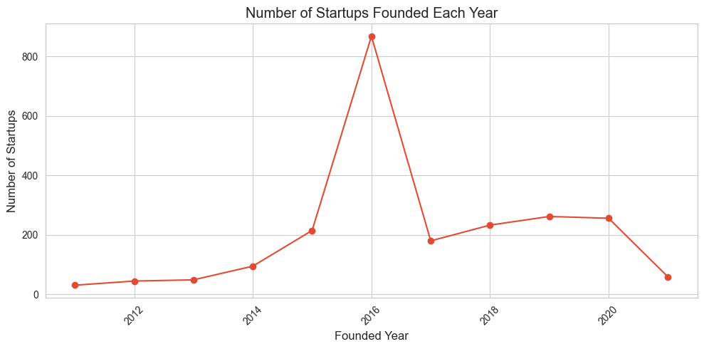

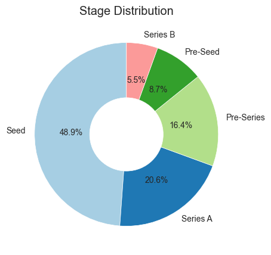

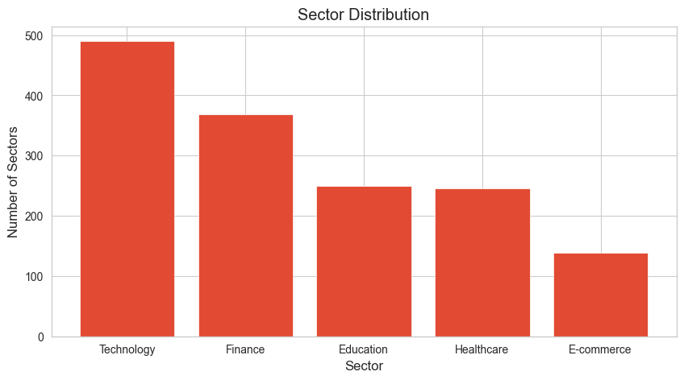

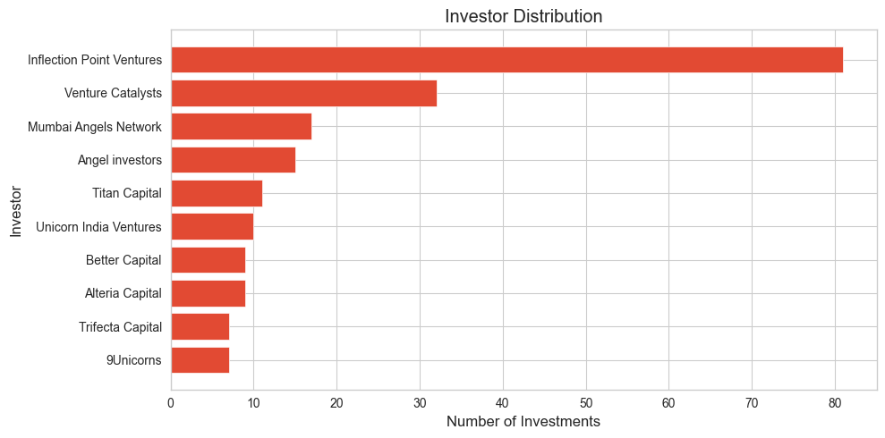

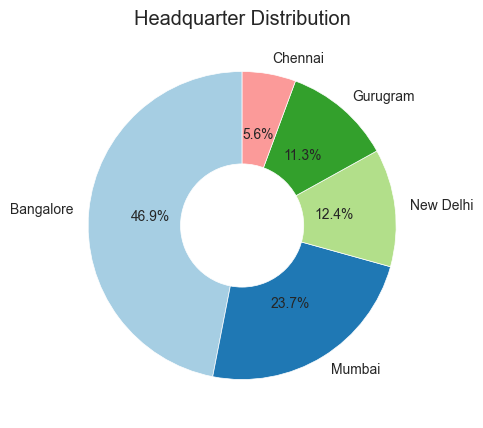

### Multivariate Analysis 

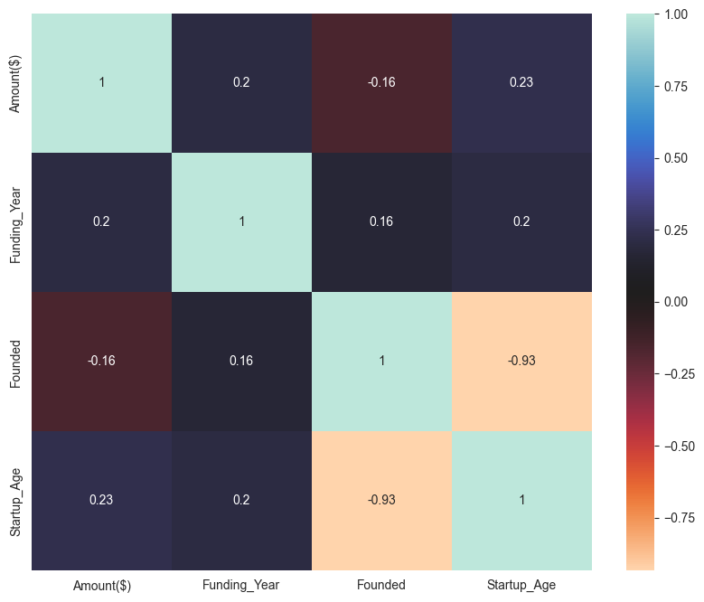

## Hypothesis development 

✨ NULL: The location of a startup has no significant effect on the amount received from investors.

✨ ALTERNATE: The location of a startup significantly influences the amount received from investors.

Based on the Kruskal-Wallis test results, we observed a significant difference in the amount raised among different startup locations (p < 0.05). Therefore, we reject the null hypothesis (H0) and accept the alternative hypothesis (H1), suggesting that the location of a startup does affect the amount of funding received from investors.

## Business Questions 

## Key Findings :mag_right:

✨ The location of startup can impact the success of getting funded. 

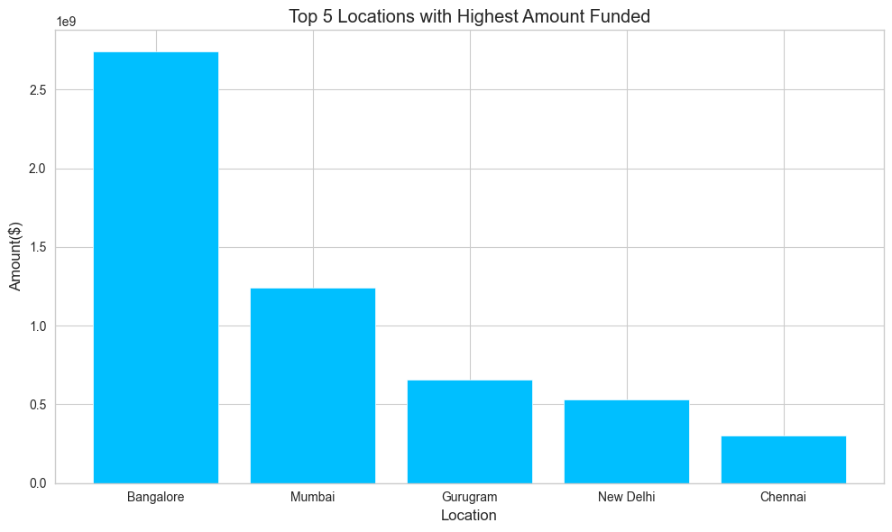

Bangalore is leading when it comes to startup funding with about $2,741,151,000 total investments  :chart_with_upwards_trend: :moneybag:

✨ The type of sector can affect the success of receiving funding. 

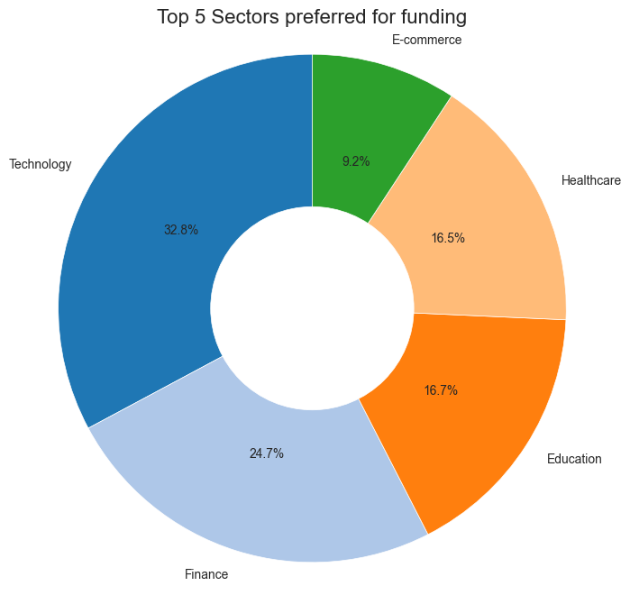

Technology is the most preferred sector with about 32.8% startups followed by finance with 24.7% established startups :rocket: :money_with_wings:

✨ Start-ups receive more funding at the seed stage, indicating its significance in attracting investments :seedling: :moneybag:

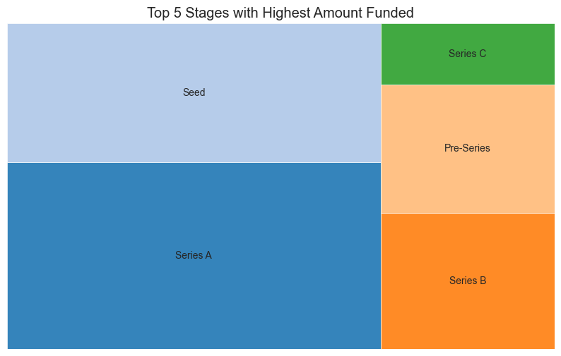

✨ Finance and technology receive the highest amounts of about $1,474,923,000 and $1,271,999,000 respectively:money_with_wings :chart_with_upwards_trend:

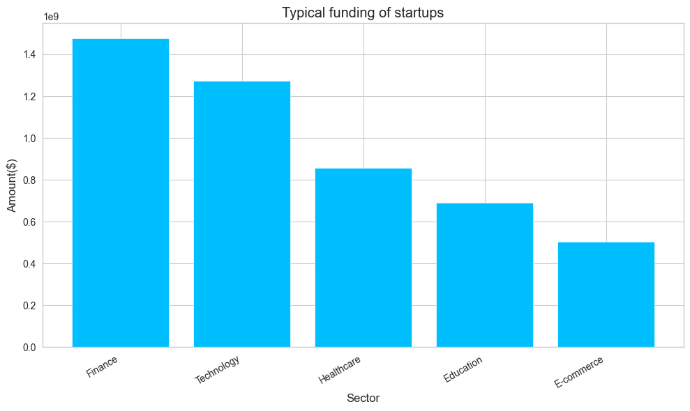

✨ Inflection Point Ventures are the top investors with about $124,925,000 investments :money_with_wings: :chart_with_upwards_trend:

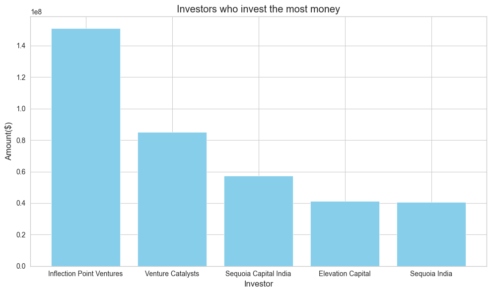

## Conclusions 

The data clearly indicates that the geographic location of a startup plays a crucial role in determining the funding it receives. Certain locations demonstrate a higher tendency to attract more significant investments, while others might face challenges in attracting substantial funding

## Key Insights :chart_with_upwards_trend:

✨ Finance and technology sectors are particularly booming in the Indian startup ecosystem :moneybag: :mortar_board:

✨ Bangalore is at the forefront startup developments :cityscape:

✨ Start-ups receive more funding at the seed stage :chart_with_upwards_trend:

The Indian startup ecosystem is the 3rd largest in the world and an influential force in the global market. This analysis will offer valuable insights to important stakeholders, enabling them to make well-informed business decisions based on data-driven information and contribute to the growth and success of startups in India.

Let's add some excitement towards a data-driven economy! :sparkles:

## Author

`Phonex Chemutai`

`Data Analyst`

`Azubi Africa`

Read more on my Medium blog: [Medium Article]